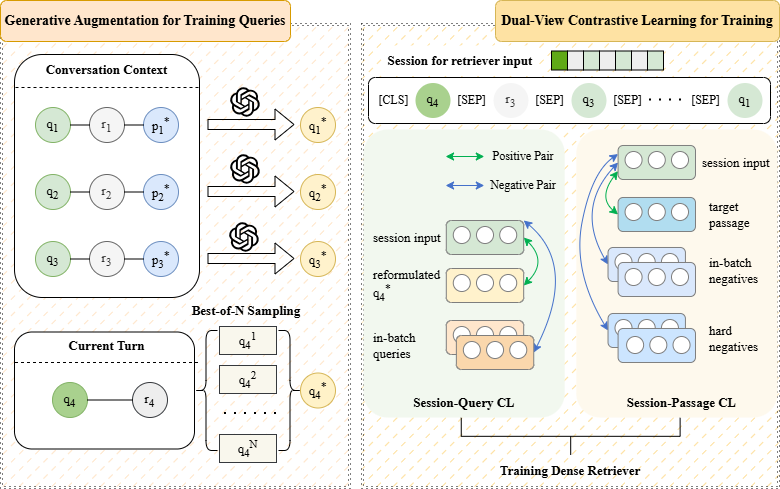

# GQADCR

This repository contains the code for the paper "Generative Query Augmentation with Dual-View Contrastive Learning for Dense Retrieval in Conversational Search".



---

## 🔧 Setup

1. Clone the repository:

   ```bash
   git clone https://github.com/ywy5516/GQADCR.git
   cd GQADCR
   ```

2. Create a virtual environment:

   ```bash
   conda create -n gqadcr python=3.10
   conda activate gqadcr
   pip install -r requirements.txt
   ```

    > **Note**: `requirements.txt` lists only the primary dependencies.

---

## 📊 Data

We use open-source datasets for training and evaluation. You can download them from:

1. qrecc: [github](https://github.com/scai-conf/SCAI-QReCC-21)
2. topiocqa: [huggingface](https://huggingface.co/datasets/McGill-NLP/TopiOCQA/tree/main/data) and [zenodo](https://zenodo.org/records/6149599/files/data/wikipedia_split/full_wiki_segments.tsv)

Note: The data is not included in this repository. Please download and extract them separately to the `corpus/qrecc` and `corpus/topiocqa` directories. There is an example:
```bash
corpus/
  qrecc/
    commoncrawl/
    wayback/
    wayback-backfill/
    scai-qrecc21-training-turns.json
    scai-qrecc21-test-turns.json
  topiocqa/
    full_wiki_segments.tsv
    topiocqa_train.jsonl
    topiocqa_valid.jsonl
> ```

---

## 🚀 Run Instructions

### 1. Preprocess

```bash
python python src/preprocess/qrecc.py

python python src/preprocess/topiocqa.py
```

### 2. Build Index

```bash
python src/indexer/build_dense_index.py

python src/indexer/build_sparse_index.py
```

The experiment employs [Pyserini](https://github.com/castorini/pyserini) to construct sparse indexes. After submission, we discovered that [bm25s](https://github.com/xhluca/bm25s) can build indexes and perform retrieval with significantly higher efficiency, while exhibiting no discernible difference in precision. Therefore, we provide code for indexing and retrieval based on `bm25s` for reference. For the implementation of `Pyserini`, please refer to [ConvSearch-R1](https://github.com/BeastyZ/ConvSearch-R1).


### 3. Data Augmentation

First, launch the large language model using `vllm`:

```bash
CUDA_VISIBLE_DEVICES=0 vllm serve $LLM_PATH --served-model-name $LLM_NAME --dtype auto --max-model-len 4096 --task generate --no-enable-prefix-caching --port 8071
```

Then run the following scripts for the topiocqa and qrecc datasets respectively:

```bash
python src/rewriter/multi_rewrite.py

python src/rewriter/best_of_n.py
```

Following that, start the sparse retrieval service:

```bash
python src/retriever/server.py --retriever_type sparse --port 8005
```

Finally, perform filtering and negative sampling:

```bash
python src/rewriter/best_of_n.py --port 8005

python src/retriever/negative_sample.py --port 8005
```

### 4. Train

Start the dense retrieval service:

```bash
CUDA_VISIBLE_DEVICES=1 src/retriever/server.py --retriever_type dense --port 8006 ...
```

Train the model:

```bash
CUDA_VISIBLE_DEVICES=2 python src/train/main.py --train_model_path $PRETRAIN_MODEL_PATH ...
```

### 5. Inference and Evaluate

```bash
python src/retriever/retrieval.py --input_dir data/qrecc/parsed_dev --input_key $INPUT_KEY --port $PORT --save_path $SAVE_PATH ...
# python src/retriever/retrieval.py --input_dir data/topiocqa/parsed_dev --input_key $INPUT_KEY --port $PORT --save_path $SAVE_PATH ...

python src/eval.py -r $SAVE_PATH -q data/qrecc/dev_qrels.tsv
# python src/eval.py -r $SAVE_PATH -q data/topiocqa/dev_qrels.tsv
```